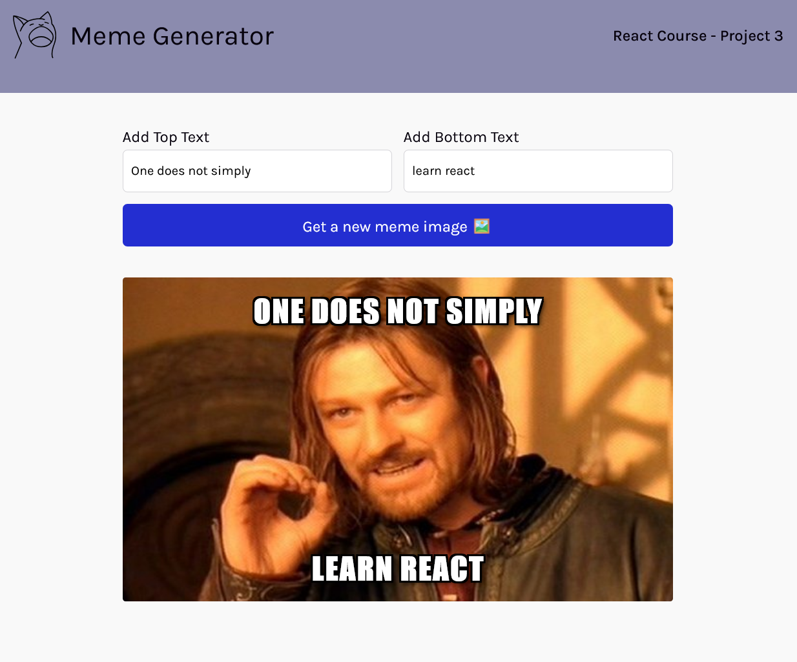

# Meme Generator React Web App - A Scrimba Frontend Career Path project

This is solution code to the Scrimba Frontend Career Path project, Build a Meme Generator with React.

## Table of contents

- [Overview](#overview)
  - [React concepts](#react-concepts)
  - [Screenshot](#screenshot)
  - [Links](#links)
- [My process](#my-process)
  - [Built with](#built-with)
  - [Useful resources](#useful-resources)
- [Author](#author)

## Overview

### React concepts
This project features the use of the following React hooks and concepts

- Event listeners
- State
- Conditional rendering
- Forms
- Side effects

### Screenshot

### Links

- [Scrimba Scrim URL](https://scrimba.com/scrim/co6a4409bb0f262db4763763f)
- [Live Site URL](https://mellow-beijinho-d54ea2.netlify.app/)

## My process

### Built with

- [React](https://reactjs.org/) - JS library

### Useful resources

- [React Docs](https://react.dev/learn) - Outside of the Scrimba curriculum materials leading up to this project, I found the official React documentation an excellent reference.

## Author

- Website - [Matt Pahuta](https://www.mattpahuta.com)
- Twitter/X - [@mattpahuta](https://www.twitter.com/MattPahuta)
- LinkedIn - [Matt Pahuta](www.linkedin.com/in/mattpahuta)